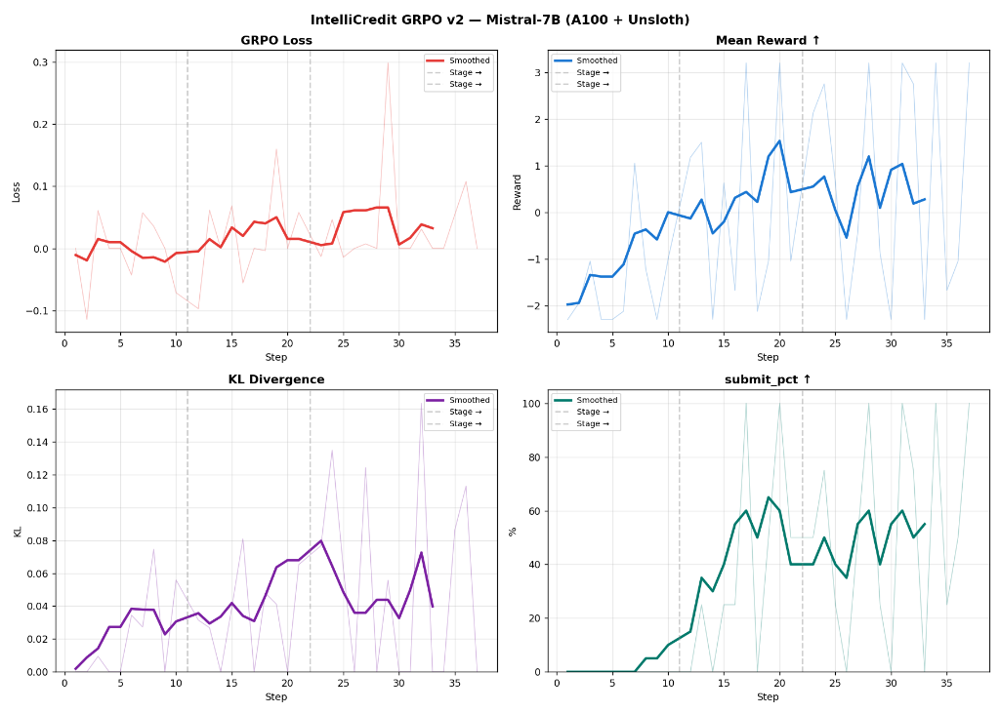
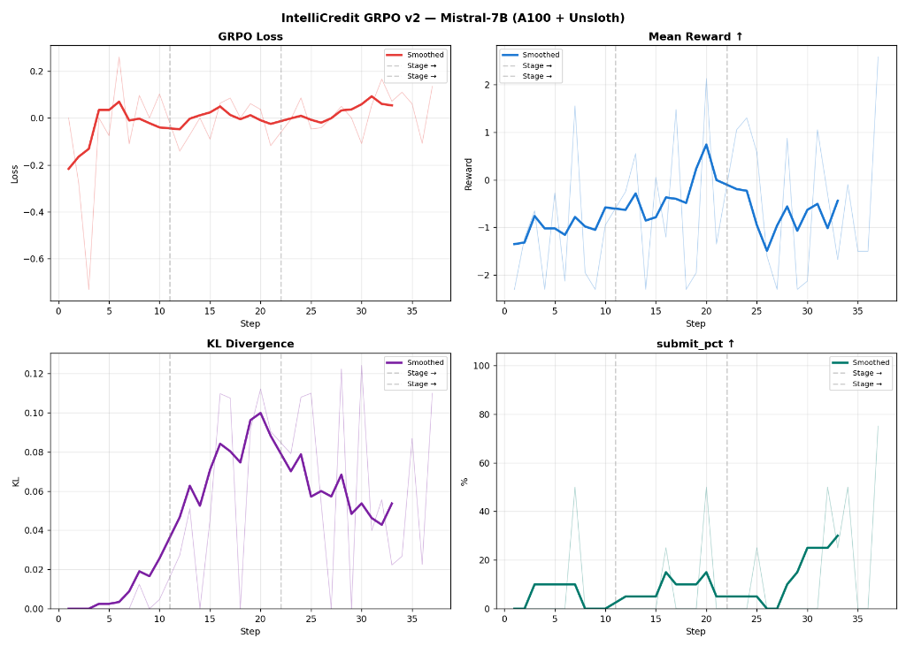

# 🏦 IntelliCredit-X — Teaching an LLM to Think Like a Credit Officer

<div align="center">

[](https://huggingface.co/spaces/vssksn/intellicredit-openenv)
[](https://huggingface.co/datasets/vssksn/intellicredit-grpo-dataset)
[](https://huggingface.co/vssksn/intellicredit-mistral-7b-grpo)
[](https://github.com/1919-14/intellicredit-openenv)
[](https://vssksn-intellicredit-openenv.hf.space/docs)
[](./docs/blog.md)
[](LICENSE)
[](./VERSIONING.md)
[](https://github.com/meta-pytorch/openenv)

**By V S S K Sai Narayana & Sujeet Jaiswal**  
*Meta × Hugging Face OpenEnv Hackathon 2025*

</div>

---

> **IntelliCredit-X** is an OpenEnv-compliant multi-agent reinforcement learning environment where an LLM learns to act as a regulatory-compliant Senior Credit Officer — investigating fraud signals via tool calls, managing a live loan portfolio across 50-step episodes, and respecting hard RBI mandates enforced by a RegulatorAgent. After GRPO fine-tuning of Mistral-7B, NPA rate halved on the hardest task and total reward improved 10×.

---

## 📊 Results at a Glance



*Baseline Mistral-7B-Instruct-v0.3 (blue) vs. GRPO-trained IntelliCredit model (green) — **zero regressions across all 24 metric-task combinations.***

| Task | Metric | Base Model | GRPO Model | Δ |
|------|--------|-----------|-----------|---|
| Task 1 (Easy) | Score | 0.900 | **0.955** | **+0.055 ✅** |
| | Accuracy | 80.0% | **86.7%** | **+6.7% ✅** |
| | Capital Util | 40.0% | **60.0%** | **+20.0% ✅** |
| Task 2 (Medium) | Score | 1.000 | 1.000 | ceiling ✅ |
| | Total Reward | 10.305 | **10.584** | **+0.279 ✅** |
| Task 3 (Hard) | Score | 0.767 | **0.833** | **+0.067 ✅** |
| | Total Reward | 0.215 | **2.491** | **+2.276 ✅ (10×!)** |
| | **NPA Rate** | **16.7%** | **8.3%** | **−8.3% ✅ (halved!)** |

---

## 🎯 Core Motivation

The MSME lending sector in India processes over **100,000 loan applications daily**. Current bottlenecks:

- A senior loan officer reviews **~16 applications/day** — 0.016% of total volume by human experts
- **12–15% annual default rates** due to poor risk assessment
- **Manual cross-referencing** of GST, MCA, CIBIL, court records takes days per application
- **No explainable audit trail** — decisions based on "gut feeling" under time pressure

**Our approach:** Create a training ground where an AI learns to *think* like the best credit officers — gathering evidence, detecting hidden fraud, respecting non-negotiable regulations, and managing portfolio risk across time.

---

## ⚙️ How the Environment Works (v2.0)

An agent plays a **50-step Credit Committee Episode**:

```
Step T = 1..50:
  1. Environment generates an MSME application (Anchor × Sector × Size × Tier)
  2. Agent sees 55D observation (application + portfolio + macro + memory)
  3. Agent may call up to 4 investigation tools
  4. Agent submits: APPROVE (0) | CONDITIONAL (1) | REJECT (2)
  5. Reward computed: R1 (correctness) + R2 (hard rules) + R3 (format) + R4 (portfolio)
  6. Approved loans join portfolio
  7. RegulatorAgent audits at jittered steps ≈ 10/20/30/40/50
  8. Loan maturity events fire T+10 to T+30 (delayed NPA consequences)
  9. At step 50: settlement reward + Reflection Module activates
```

### Multi-Agent System

| Agent | Simulated By | Responsibility |
|-------|-------------|----------------|
| **Credit Officer** | LLM (GRPO fine-tuned) | Reviews applications, calls tools, makes decisions |
| **BorrowerAgent** | Programmatic | Reapplies after rejection with improved *surface* metrics (hidden PD unchanged) |
| **RegulatorAgent** | Programmatic | Audits at ≈steps 10/20/30/40/50, shuts down episode after 3 consecutive failures |

---

## 🧠 Training Curves



*IntelliCredit GRPO v2 training across 3 curriculum stages. Note the key inflection points at stage transitions (dashed lines):*

- **GRPO Loss (red):** Controlled upward drift from ~0 → 0.05 — policy is meaningfully diverging from base model
- **Mean Reward (blue):** Starts at −2.0 (random violations), crosses zero by step 10, stabilizes near +0.5–+1.0 — **the environment is learnable**
- **KL Divergence (purple):** Grows to ~0.04–0.08 — model learned new behaviors while preserving language capability
- **`submit_pct` (teal):** Format compliance climbs from 0% → 40–65% — model acquires the task's vocabulary

---

## 🛑 Regulatory Rules (6 Non-Negotiable Hard Rules)

| Rule | Condition | Action |
|------|-----------|--------|
| **HR-01** | DSCR < 1.0 | Mandatory REJECT + −2.0 penalty |
| **HR-02** | Director disqualified (DIN < 0.1) | Mandatory REJECT + −2.0 penalty |
| **HR-03** | RED forensic alert present | Mandatory REJECT + −2.0 penalty |
| **HR-04** | Cheque bounce rate > 25% | Mandatory REJECT + −2.0 penalty |
| **HR-05** | GST compliance < 40% | Mandatory REJECT + −2.0 penalty |
| **HR-06** | Severe adverse media (> 0.80) | Mandatory REJECT + −2.0 penalty |

### Portfolio Constraints

| Constraint | Threshold | Consequence |
|------------|-----------|-------------|
| CRAR | > 12.5% | Episode terminates if breached |
| NPA Rate | < 5% | Episode terminates if breached |
| Sector Concentration | < 30% | −8.0 penalty per audit |
| Single Borrower | < 15% | −5.0 penalty per audit |

---

## 👁️ Observation Space (55D)

The agent observes a **55-dimensional vector** bounded `[−1.0, +1.0]`.
*(−1.0 = sentinel for missing/masked data — teaching the agent that data absence itself is a risk signal.)*

| Group | Dims | Description |
|-------|------|-------------|
| Application Features | 0–24 | 25 financial/forensic/governance ratios (DSCR, GST gap, DIN, DSCR, etc.) |
| Portfolio State | 25–34 | Capital deployed, NPA rate, CRAR, provisioning coverage, sector flags |
| Macro State | 35–39 | Systemic stress, GDP growth, inflation, credit cycle phase |
| Alert State | 40–44 | Running RED/YELLOW alert tallies from episode |
| **Memory Features** *(v2 NEW)* | **45–54** | **Rolling NPA, approval rate, sector concentration, audit risk, borrower persistence, capital buffer, episode progress** |

**Key dimensions:**
- `Dim 49: borrower_persistence_score` — 0.0=1st attempt, 0.5=2nd, **1.0=3rd attempt (maximum manipulation risk)**
- `Dim 50: audit_risk_score` — proximity to next regulator audit
- `Dim 51: capital_buffer_ratio` — headroom above minimum CRAR

---

## 🕹️ Action Space + Tool Calling

**Discrete(3):** APPROVE(0) | CONDITIONAL(1) | REJECT(2) — plus optional tool calls before deciding.

### Investigation Tools (up to 4 per step)

| Tool | Returns | Best Used When |
|------|---------|----------------|
| `get_financial_report(company_id)` | 3yr revenue trend, EBITDA, auditor remarks, related-party txns | Borderline financials, need trend confirmation |
| `check_compliance_status(company_id)` | DIN status, NCLT cases, GST filings, CIBIL, prior defaults | RED alert present, low governance score |
| `get_market_intelligence(sector)` | Sector stress, RBI advisory, portfolio exposure, peer NPA rate | Approaching 30% concentration limit |
| `submit_decision(action, reasoning)` | Finalizes step (reasoning ≥ 50 chars required) | After investigation complete |

---

## 📈 Reward System

| Component | Weight | Range | Description |
|-----------|--------|-------|-------------|
| R1: Decision Correctness | 40% | [−2.0, +1.0] | PD-based decision quality |
| R2: Hard Rule Compliance | 30% | [−2.0, +0.5] | RBI hard rule adherence |
| R3: Format Compliance | 15% | [−0.3, +0.3] | `submit_decision()` format quality |
| R4: Portfolio Awareness | 15% | [−0.8, +0.3] | NPA/CRAR/concentration sensitivity |

**Delayed Events:** Loan maturity fires T+10 to T+30 after approval (Repaid: +10.0, Defaulted: −15.0×(1−recovery))  
**Audit Bonus:** +2.0 clean audit / −8.0 violation / −15.0 capital breach / −50.0 shutdown (3rd failure)  
**Settlement (step 50):** `0.30×yield + 0.30×(1−npa) + 0.20×compliance + 0.20×capital_util`

---

## 🤖 GRPO Training Pipeline

Fine-tunes `mistralai/Mistral-7B-Instruct-v0.3` via **Group Relative Policy Optimization** using TRL + Unsloth on A100 80GB (~45 minutes).

### 3-Stage Curriculum

| Stage | Data | LR | Goal |
|-------|------|----|------|
| Stage 0 (SFT Warmup) | Mixed | 5e-5 | Bootstrap `submit_decision()` format compliance |
| Stage 1 | task1 (Easy) | 5e-6 | Hard rule recognition on clean profiles |
| Stage 2 | task1 + task2 | 5e-6 | Forensic alert detection, tool call initiation |
| Stage 3 | All tasks | 2e-6 | Long-horizon portfolio management |

```
Config: rank=16 QLoRA, seq_len=2048, 8 generations/prompt
        batch=2 + grad_accum=8 (effective=16), KL β=0.001
```

**Training script:** [`training/colab_grpo_3b_v2.py`](./training/colab_grpo_3b_v2.py)

---

## 🪞 Self-Improvement Reflection System

GRPO updates weights. The Reflection Module improves the model **without retraining** — by injecting structured lessons from episode failures into the next episode's system prompt.

```
Episode N → Analyze all steps where reward < 0
          → Extract 6 lesson types (hard rule, delayed default, audit failure,
             borrower manipulation, macro shock, portfolio overexposure)
          → Store top 20 lessons in memory_bank.json
Episode N+1 → Inject top 5 lessons into system prompt → better decisions
```

**Verified result (base model, no fine-tuning, 30 episodes):**  
Score improved from 0.22 → 0.55 purely through in-context lesson injection — a 150% improvement without changing a single weight.

---

## 🏆 Task Descriptions

| Task | Difficulty | Steps | Key Challenge |
|------|-----------|-------|---------------|
| `task1` | 🟢 Easy | 50 | Clean profiles, basic APPROVE/REJECT |
| `task2` | 🟡 Medium | 50 | Forensic alerts (YELLOW/RED), tool investigation |
| `task3` | 🔴 Hard | 50 | Macro shocks + missing data + repeat applicants |
| `task4` | 🔥 Expert | 50 | Hard-rule violations + all adversarial patterns |
| `task5` | ⚡ Master | 50 | Full: CRAR limits + cascading NPAs + 5 audits |

---

## 💻 Quick Start

### Try the Live API

```bash
# Start an episode
curl -X POST https://vssksn-intellicredit-openenv.hf.space/reset \
  -H "Content-Type: application/json" \
  -d '{"episode_id": "demo-001", "seed": 42, "task_id": "task2"}'

# Submit a decision (0=APPROVE, 1=CONDITIONAL, 2=REJECT)
curl -X POST https://vssksn-intellicredit-openenv.hf.space/step \
  -H "Content-Type: application/json" \
  -d '{"episode_id": "demo-001", "action": {"decision": 2}}'
```

**→ [Full Swagger UI](https://vssksn-intellicredit-openenv.hf.space/docs)**

### Local Setup

```bash
git clone https://github.com/1919-14/intellicredit-openenv.git --branch v2
cd intellicredit-openenv
uv venv && source .venv/bin/activate
uv pip install -r requirements.txt
python -m server.app          # → http://localhost:7860/docs
```

### Evaluate the GRPO Model

```bash
# Run GRPO model against environment
python eval_llm.py \
  --model vssksn/intellicredit-mistral-7b-grpo \
  --env-url http://localhost:7860 \
  --out grpo_results.json

# Compare vs base model
python eval_llm.py \
  --model mistralai/Mistral-7B-Instruct-v0.3 \
  --env-url http://localhost:7860 \
  --out base_results.json

# Generate comparison chart
python compare_results.py \
  --baseline base_results.json \
  --after grpo_results.json \
  --out comparison.png
```

### Docker

```bash
docker build -t intellicredit-v2 .
docker run -p 7860:7860 intellicredit-v2
```

---

## 📁 Project Structure

```
intellicredit-openenv/
├── server/
│   ├── app.py                 # FastAPI server — /reset, /step, /info, /health
│   ├── intellicredit_env.py   # v2 core: WorldState, 50-step lifecycle, multi-agent
│   ├── dataset.py             # Application generator (Anchor × Sector × Size × Tier)
│   ├── reward.py              # R1-R4 reward engine + settlement grader
│   ├── action_parser.py       # LLM text → tool call / decision parser
│   ├── tool_executor.py       # Read-only tool execution (financial, compliance, market)
│   ├── agent_loop.py          # Agent orchestrator + prompt injection
│   └── reflection.py          # Self-improvement + memory bank system
│
├── training/
│   ├── colab_grpo_3b_v2.py    # ← PRIMARY: Unsloth GRPO training (A100, ~45 min)
│   ├── generate_dataset.py    # 2000-prompt GRPO dataset generator
│   ├── grpo_rewards.py        # 4 GRPO reward functions (R1-R4)
│   └── train_grpo.py          # 3-stage curriculum pipeline
│
├── evaluation/
│   ├── evaluate.py            # Multi-mode evaluation engine
│   └── compare.py             # Comparison tables + reward curves
│
├── docs/
│   ├── blog.md                # Full technical blog post
│   └── assets/
│       ├── comparison.png     # Baseline vs GRPO results chart
│       └── training_curves.png # GRPO training curves (Mistral-7B, A100)
│
├── eval_llm.py                # LLM evaluation via HTTP (base vs trained)
├── compare_results.py         # Bar chart comparison generator
├── baseline_results.json      # RuleBasedAgent reference scores
├── inference.py               # LLM inference wrapper
├── models.py                  # Pydantic schemas (55D observation, action)
├── client.py                  # HTTP client for environment interaction
├── Dockerfile                 # HF Spaces Docker deployment
└── requirements.txt           # Python dependencies
```

---

## 🔗 All Links

| Resource | Link |
|----------|------|
| 🤗 **Live Environment** | [huggingface.co/spaces/vssksn/intellicredit-openenv](https://huggingface.co/spaces/vssksn/intellicredit-openenv) |
| 🤗 **GRPO Model** | [huggingface.co/vssksn/intellicredit-mistral-7b-grpo](https://huggingface.co/vssksn/intellicredit-mistral-7b-grpo) |
| 🤗 **Training Dataset** | [huggingface.co/datasets/vssksn/intellicredit-grpo-dataset](https://huggingface.co/datasets/vssksn/intellicredit-grpo-dataset) |
| 💻 **GitHub (v2 branch)** | [github.com/1919-14/intellicredit-openenv/tree/v2](https://github.com/1919-14/intellicredit-openenv/tree/v2) |
| 📖 **API Swagger** | [vssksn-intellicredit-openenv.hf.space/docs](https://vssksn-intellicredit-openenv.hf.space/docs) |
| 📝 **Full Blog Post** | [docs/blog.md](./docs/blog.md) |
| 📊 **Project Summary** | [VERSIONING.md](./VERSIONING.md) |
| 📋 **Env Info API** | [/info endpoint](https://vssksn-intellicredit-openenv.hf.space/info) |

---

## 🐳 Docker Deployment

```bash
docker build -t intellicredit-v2 .
docker run -p 7860:7860 intellicredit-v2
# With HF token for LLM inference:
docker run -p 7860:7860 -e HF_TOKEN="your-token" intellicredit-v2
```

| Resource | Minimum | Recommended |
|----------|---------|-------------|
| CPU | 2 vCPUs | 4 vCPUs |
| RAM | 2 GB | 4 GB |
| GPU | Not required (env server) | A100 for GRPO training |

---

## 📚 Citation

```bibtex
@article{intellicredit2025,
  title   = {IntelliCredit-X: A Multi-Agent Constrained MDP for MSME Credit
             Appraisal with GRPO Fine-Tuning},
  author  = {Narayana, V S S K Sai and Jaiswal, Sujeet},
  year    = {2025},
  note    = {OpenEnv Hackathon Submission — Meta × Hugging Face},
  url     = {https://huggingface.co/spaces/vssksn/intellicredit-openenv}
}
```

---

## 📜 License

MIT License — See [LICENSE](LICENSE) for details.

---

*Built by **V S S K Sai Narayana** & **Sujeet Jaiswal** for the Meta × Hugging Face OpenEnv Hackathon 2025.*
